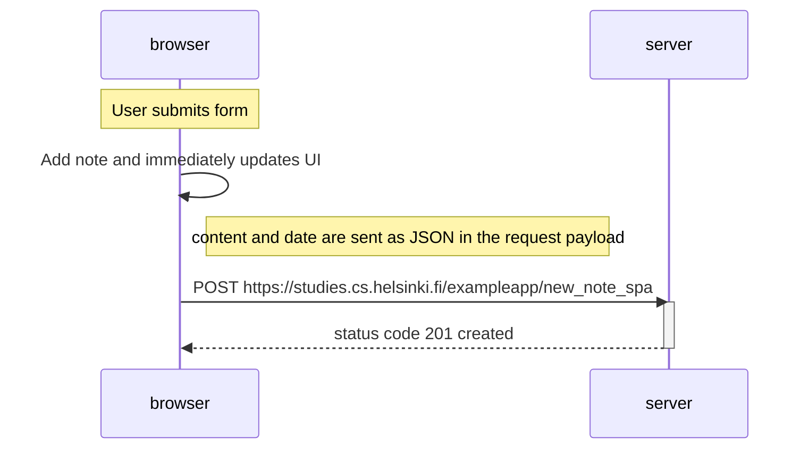

```mermaid
sequenceDiagram;
    participant browser;
    participant server;

    Note over browser: User submits form

    browser->>browser: Add note and immediately updates UI

    Note right of browser: content and date are sent as JSON in the request payload

    browser->>server: POST https://studies.cs.helsinki.fi/exampleapp/new_note_spa
    activate server
    server-->>browser: status code 201 created
    deactivate server 
```
