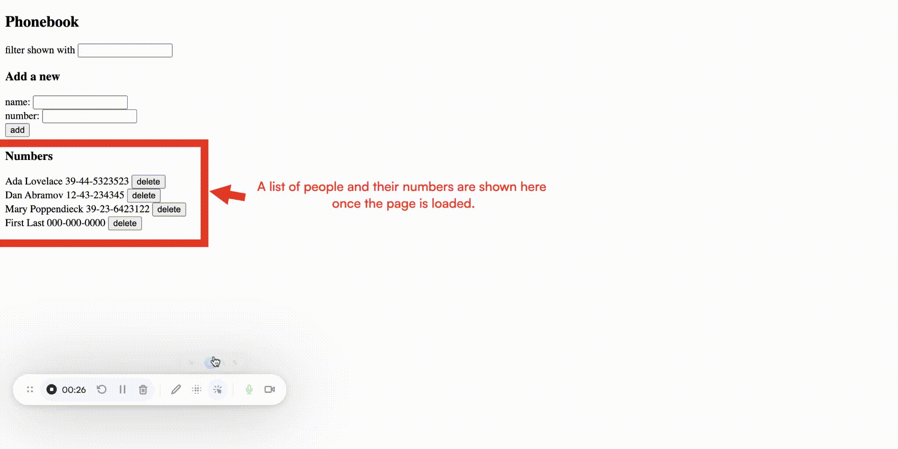

# 📖 Phonebook App
[](https://github.com/Tongxin-Sun/fullStackOpen/tree/main/part2/phonebook)

A simple React application built as part of the [Full Stack Open](https://fullstackopen.com) course.

The app allows users to:

- View all saved contacts

- Add new contacts with a name and phone number  

  
- Filter contacts by name  
- Delete existing contacts  

---

## 🚀 Getting Started

Follow these steps to run the project locally.

### 1. Clone the repository

```bash
git clone https://github.com/Tongxin-Sun/fullStackOpen.git
cd fullStackOpen/part2/phonebook
```

### 2. Install dependencies
Make sure you have **Node.js (>=18)** and **npm** installed.
Then run:

```bash
npm install
```

### 3. Start the development server
Start the back end by running:
```bash
npm run server
```
This will start the backend using json-server.  [](https://github.com/typicode/json-server)

Once it’s running, you can open http://localhost:3001/persons
 in your browser to view the persons data.

Then, start the front end by running:
```bash
npm run dev
```

This will start the app in development mode.
Open [http://localhost:5173](http://localhost:5173) to view it in your browser.

---

## 📂 Project Structure

```
part2/phonebook/
├── src/
│   ├── components/   # Reusable React components
│   ├── services/     # API calls (if connected to backend later)
│   ├── App.js        # Main application logic
│   └── index.js      # Entry point
├── package.json
├── db.json           # Data for backend
└── README.md
```

## 🌱 Next Steps

This project can be extended with:

* Connection to a backend (e.g. JSON Server or Express)
* Notifications for success/error messages
* Deeper styling with CSS frameworks
