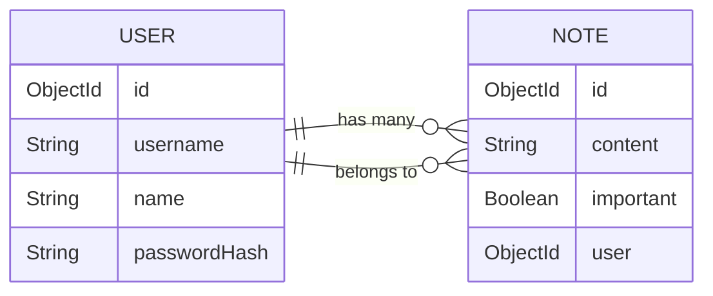

## User administration
Users should be stored in the **database** and every note should be linked to the user who **created** it. 

**Deleting** and **editing** constraints: Deleting and editing a note should only be allowed for the user who created it. 

There is a one-to-many relationship between the user (*User*) and notes (*Note*).

>| Starting from version 3.2. Mongo has supported [lookup aggregation queries](https://www.mongodb.com/docs/manual/reference/operator/aggregation/lookup/).

1. Creating a User

Users have a unique *username*, a *name* and something called a *passwordHash*. 

In order to protect users' passwords, the actual passwords are not stored in the database. Instead, we use a **one-way hash function** to generate a passwordHash. We use the [bcrypt](https://github.com/kelektiv/node.bcrypt.js) package for generating this passwordHash.  