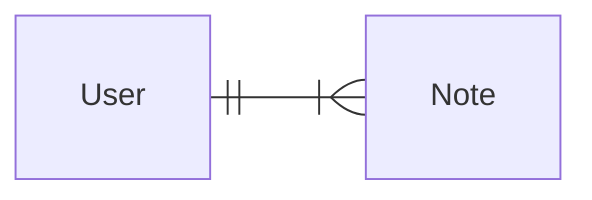

# 
Blog List

> Note: This app should use node.js version v22.3.0 or above.

## User administration
Users should be stored in the **database** and every note should be linked to the user who **created** it. 

**Deleting** and **editing** constraints: Deleting and editing a note should only be allowed for the user who created it. 

There is a one-to-many relationship between the user (*User*) and notes (*Note*).

|