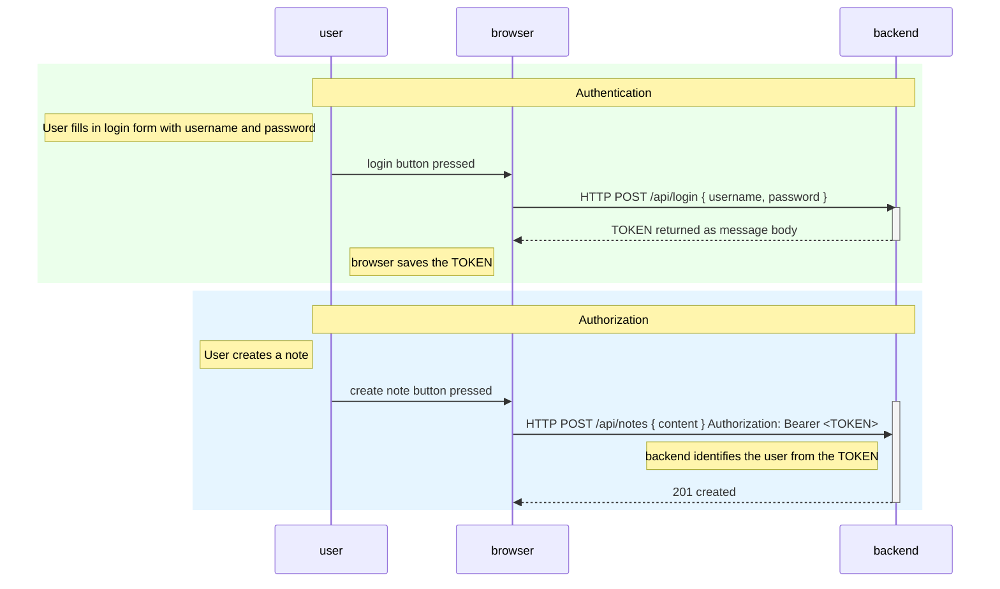

# 
Blog List

> Note: This app should use node.js version v22.3.0 or above.

## 
Token-based authentication

This app implements token-based authentication. Below is a sequence diagram of how the token-based authentication works. 

```mermaid
sequenceDiagram;
  participant user;
  participant browser;
  participant backend;
  
  rect rgba(235, 255, 235)
    NOTE over user, backend: Authentication
    Note left of user: User fills in login form with username and password
    user->>browser: login button pressed
    browser->>backend: HTTP POST /api/login { username, password }
    activate backend
    backend-->>browser: TOKEN returned as message body
    deactivate backend
    Note left of browser: browser saves the TOKEN
  end

  rect rgba(230, 245, 255)
    Note over user, backend: Authorization
    Note left of user: User creates a note
    user->>browser: create note button pressed
    activate backend
    browser->>backend: HTTP POST /api/notes { content } Authorization: Bearer <TOKEN>
    Note left of backend: backend identifies the user from the TOKEN
    backend-->>browser: 201 created
    deactivate backend
  end
```
